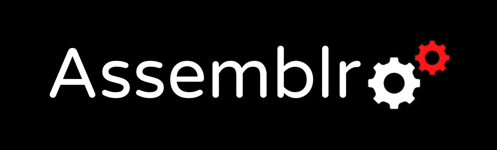
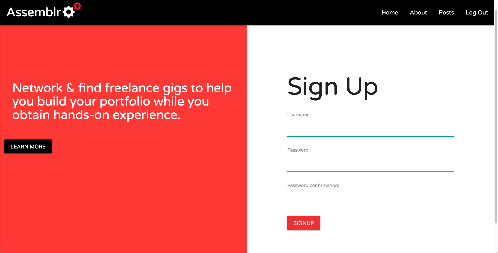
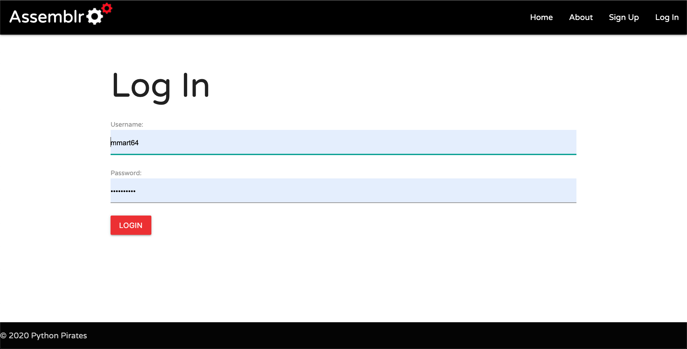
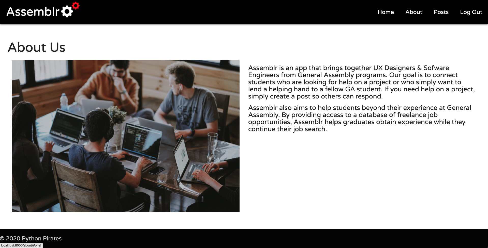
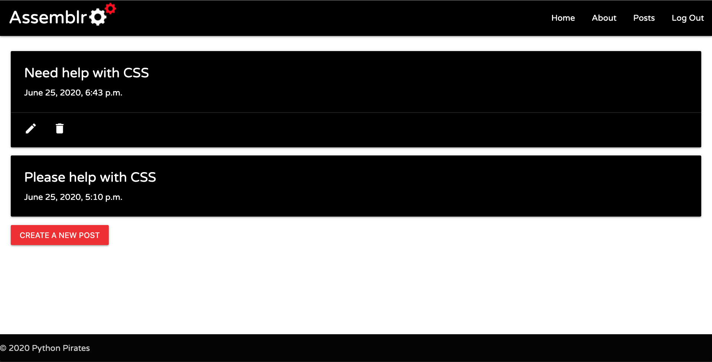
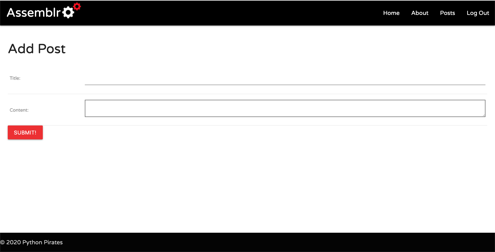

Date: 6/26/2020

By:

Monica Martinez-Jimenez

[Website]() | [GitHub](https://github.com/monicamartinez64) | [LinkedIn](https://www.linkedin.com/in/monicamj/)

Gabriel Varella

[Website]() | [Github](https://github.com/GabiVarella) | [LinkedIn](https://www.linkedin.com/in/gabriel-varella-08a308184/)

Chris White

[Website]() | [GitHub](https://github.com/ChrisChroma) | [LinkedIn](https://www.linkedin.com/in/chrischromadev/)

Samuel Trahan

[Website](samueltrahan.com) | [GitHub](https://github.com/samueltrahan) | [LinkedIn](https://www.linkedin.com/in/samueltrahan/)

---

## Description

Assemblr is an application connecting General Assembly students from different programs to each other. Making collaboration and help only a post away.

---

## Technologies Used

Python
Django
HTML
CSS
GitHub
Heroku
Postgres
SQL

---

## Getting Started

Start off by creating a new user and signing into the app. Once you are signed in, create posts about projects and work that UX Designers and Software Engineers from General Assembly can collaborate on.

A pitch deck was made to present this project and can be viewed [here](https://docs.google.com/presentation/d/1Zmg2Hqge2GfSgzLvz43N6uXpsD1Ik5zn6Eb2PQG6bp8/edit?usp=sharing)

A Trello Board was used to keep track of development progress and can be viewed [here](https://trello.com/b/3SzsXMa7/assemblr)

The project was deployed using Heroku and can be viewed [here]()

---

## Screenshots

---

## Credits

CSS Styling: [Materialize](https://materializecss.com/)

---

## Future Updates

- [ ] Implement Upwork API to give users a space to search for freelance work.
- [ ] Add a messaging API so users can easily interact with each other
- [ ] Add GitHub Projects to the app.
- [ ] Search Functionality to sort through users posts
- [ ] Creating a user profile
- [ ] Add AWS to the project for users posts and profiles.

